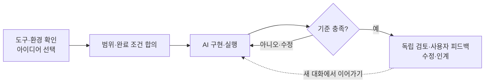

## 1. 워크숍 목표 및 진행 개요

**업무 시나리오 5개 중 하나를 선택**하여 자연어 기반으로 웹앱·업무 도구·에이전트를 제작합니다. 요구사항 정의, 구현, 실행 검증, 동료 피드백 반영을 수행하며 결과물 형태와 추가 기능은 참가자가 결정합니다. 사전 작성된 코드 재현보다 **업무 요구의 구체화와 실행 결과에 기반한 개선 역량**에 중점을 둡니다.



**주요 산출물:** 실행 가능한 결과물, 제작·수정 프롬프트, 요구사항·실행 기록, 업무 적용 과제. 발표·투표·시상 방식은 별도 운영 기준을 적용합니다.

## 2. 개발 도구 비교 및 선정

### 개발 도구·실행 모델·서비스의 역할

| 구성 | 역할 | 제품 예시 |
|---|---|---|
| **코딩 도구** | 자연어 요청 기반 코드 생성·수정·실행 | GitHub Copilot, Copilot CLI, Codex CLI |
| **실행 모델** | 만든 에이전트가 사용자의 요청을 해석하고 도구를 선택 | Foundry에서 제공하는 모델 |
| **데이터·배포 서비스** | 데이터 저장, 여러 사람의 접속, 서비스 실행 | Azure SQL, Cosmos DB, App Service 등 |

**Azure 구독과 코딩 도구 이용권은 별도입니다.** 개발 도구 사용 권한과 결과물의 Azure 실행 권한·비용을 구분하여 준비합니다.

### 도구 비교

Azure 서비스와 연계되는 결과물을 개발하기 위한 도구 비교입니다. 각 도구의 설치·인증·과금 체계는 Azure 포털과 별도로 확인합니다.

| 도구 | 주요 강점 | 도입 고려사항 | 적용 기준 |
|---|---|---|---|
| **GitHub Copilot — VS Code Agent 모드** | 대화·파일·변경 내용을 한 화면에서 확인. 앱·도구·에이전트 제작 가능 | Copilot 사용 권한과 조직 정책 확인. 실행 환경 설치는 필요할 수 있음 | **비개발자 대상 기본 권장안** |
| **GitHub Copilot CLI** | 터미널에서 대화로 제작·실행. 편집기를 강제하지 않음 | CLI를 설치해도 사용 권한이 자동 제공되지는 않음. 파일 변경 확인에 익숙해져야 함 | 터미널 중심 진행을 원하는 경우 |
| **Codex CLI** | 자연어로 여러 파일 작성·수정·실행. Azure를 사용하는 코드도 제작 가능 | 별도 지원 플랜 또는 API 인증·과금과 고객 정책 확인 | 고객이 승인한 Codex 환경이 있으면 대안 |
| **Copilot Studio** | 에이전트·업무 흐름 제작, 연결·게시 기능 제공 | Power Platform 환경·권한·라이선스 준비. 자유 코드 제작과는 다른 방식 | 관리형 에이전트 제작 방식의 비교 대상 |
| **Power Apps의 Copilot** | 업무 데이터와 입력·조회 앱을 빠르게 구성 | Dataverse·환경 권한·기능 지원 지역 확인. 앱 중심 | 업무 앱 제작 방식의 비교 대상 |

**기본 권장안:** GitHub Copilot의 VS Code Agent 모드. 파일·변경 내역·실행 결과를 동일 환경에서 확인할 수 있습니다. **고객의 라이선스·정책을 확인하고 승인된 Codex 등 대안과 비교하여 강사가 공통 도구를 지정합니다.** 참가자별 도구 선택을 전제로 하지 않습니다.

무료·체험 플랜은 기능·사용량 제한을 검토합니다. 참가자 계정으로 파일 생성·수정을 사전 실행하고 잔여 사용량을 확인합니다. 제품별 조건은 [설치 안내](docs/setup.md)의 공식 문서를 참조합니다.

## 3. 고객 환경 및 사전 준비 요건

**구독·권한·정책을 사전에 확보하고, 개별 서비스는 요구사항에 따라 구성합니다.** Foundry·DB의 참가자별 사전 생성은 필수 요건이 아닙니다.

| 확인 항목 | 고객 담당자·강사가 준비할 내용 | 준비 완료 기준 |
|---|---|---|
| **실습 도구·계정·라이선스** | 강사가 지정한 도구, 참가자 계정과 사용 권한, 부족 시 확보 방식 | 실제 참가자 계정으로 제작 요청이 동작 |
| **고객 Azure 구독·테넌트** | 실습에 사용할 구독·디렉터리, 비용 부담 주체 | 담당자가 사용할 구독을 명확히 안내 |
| **생성·접근 권한** | 실습 전용 리소스 그룹 범위, 참가자 직접 생성 또는 관리자 지원 방식 | 필요한 생성·사용·역할 할당 요청을 처리할 담당자 확보 |
| **비용·지역·정책** | 예산 한도, 사용 가능한 서비스·지역, 모델 할당량, 초과 시 처리 | 승인 범위와 중단·정리 방법 안내 |
| **네트워크·설치 정책** | 코딩 서비스·패키지·Azure 접속, 확장·CLI 설치, 사설 접속 필요 여부 | 고객 PC와 사내망에서 설치·로그인 확인 |
| **교육용 데이터·공유 범위** | 합성 데이터 사용, 소스와 결과물의 공개 가능 범위 | 실제 고객정보·비밀 값 없이 진행 가능 |

구독 전체 관리자 권한을 참가자 모두에게 주지 않습니다. 필요한 권한은 지정 범위로 제한합니다. 예산 알림은 자동 과금 차단 장치가 아니므로 운영자가 사용량을 확인합니다.

**참가자:** 지정된 도구에 로그인하고 작업 폴더를 만들 수 있으면 공통 실습을 시작합니다. Python·Node.js·DB 드라이버 등은 선택한 도구·구현에 필요한 것만 설치합니다.

**환경 사전 점검:** 실제 참가자 계정으로 프로젝트 읽기·파일 생성·수정을 확인합니다. 구현 방식이 정해지면 필요한 런타임·모델·DB만 추가 점검합니다. 설치 완료와 실행 가능 상태를 구분하며, [점검 절차와 통과 기준](docs/setup.md#readiness-check)을 적용합니다.

## 4. 실습 시나리오 및 Azure 아키텍처

<a id="어떤-에이전트를-만들까요"></a>

공식 사업 자료를 기반으로 구성한 **교육용 시나리오**입니다. 실제 회사 시스템·가격·정책을 재현하지 않으며, 시나리오명을 선택하면 개별 폴더의 업무 범위·Azure 공식 아이콘 아키텍처·완료 조건을 확인할 수 있습니다.

| 시나리오 | 대상 업무 | 결과물 예시 | 제작 요청 예시 |
|---|---|---|---|
| **[워커힐 — 고객 일정 제안](scenarios/01-itinerary)** | 방문 시간·예산·취향에 맞는 프로그램 조합 | 일정 비교 앱, 제안서 생성 도구, 상담 에이전트 | “가상 호텔 프로그램으로 예산과 시간에 맞는 일정 두 가지를 비교해줘.” |
| **[민팃 — 중고폰 판매 상담](scenarios/02-resale)** | 기종·가정 등급·회수 방법별 조건 설명 | 예상 금액 비교 도구, 상담 에이전트 | “가상 중고폰 가격으로 판매 방법과 예상 금액을 비교하고 확인할 조건을 알려줘.” |
| **[SK스피드메이트 — 접수 준비](scenarios/03-service)** | 정비 이력과 방문 조건 정리 | 이력 화면, 접수 메모 도구, 상담 준비 에이전트 | “가상 차량 이력을 정리하고 방문 전에 확인할 질문을 만들어줘.” |
| **[인크로스 — 캠페인 분석](scenarios/04-campaign)** | 광고 채널별 성과 비교와 후속 분석 | 성과 대시보드, 지표 계산 도구, 분석 에이전트 | “가상 광고 실적의 채널별 성과를 계산하고 더 살펴볼 항목을 보여줘.” |
| **[SK인텔릭스 — 파트너 검토](scenarios/05-partners)** | 해외 후보의 역량·근거·미확인 정보 비교 | 후보 비교 도구, 미팅 준비 에이전트 | “가상 파트너 후보를 비교하고 확인되지 않은 정보와 미팅 질문을 정리해줘.” |

[각 아이디어의 공식 자료·기사 근거](docs/sources.md)

**선정 산출물:** 대상 사용자·사용 상황·요구 결과를 한 문장으로 정의합니다. 기술 스택과 데이터 저장소는 요구사항 확정 후 결정합니다.

**아키텍처 적용 범위:** 각 폴더의 다이어그램은 Azure 확장 참조안이며 실제 배포 상태를 의미하지 않습니다. 필요한 서비스만 선택하고 인증·데이터 권한·네트워크·비용·승인 경계는 별도로 구성합니다.

## 5. 프로젝트 초기화

1. 이 저장소의 `starter` 폴더를 복사해 내 작업 폴더로 만듭니다.

저장소를 내려받지 않았다면 먼저 실행합니다.

```powershell
Set-Location $HOME\Documents
git clone https://github.com/SookBongnaver/MS_WS_Vibecoding.git
Copy-Item .\MS_WS_Vibecoding\starter -Destination .\MyVibeProject -Recurse
```

2. VS Code에서 **File → Open Folder**로 `MyVibeProject`를 엽니다.
3. 강사가 지정한 경로 하나로 코딩 도구를 시작합니다.

| 지정 도구 | 시작 방법 |
|---|---|
| GitHub Copilot — VS Code | Chat을 열고 **Agent 모드** 선택, 지정 GitHub 계정으로 로그인 |
| GitHub Copilot CLI | 이 폴더에서 터미널을 열고 `copilot` 실행, 안내에 따라 로그인 |
| Codex CLI | 이 폴더에서 터미널을 열고 `codex` 실행, 승인된 방식으로 로그인 |

도구 설치가 필요한 경우 [설치·로그인 안내](docs/setup.md)의 지정 경로를 적용합니다. 오류 발생 시 관리자 정책을 변경하지 않고 강사·관리자에게 문의합니다.

### 시작 템플릿 구성

```text
AGENTS.md    요구 확인·승인·구현·실행 검증 규칙
docs/        요구사항 정의서·구현 계획서
.github/     GitHub Copilot 지침
```

**템플릿 목적:** AI가 작업 기준을 읽고 요구사항·구현 범위를 정리한 후 승인된 작업을 수행하도록 합니다. 문서 초안은 AI가 작성하며 참가자가 범위와 완료 조건을 검토합니다.

여기에 **완료 조건 정하기 → 실제 실행 결과로 수정하기 → 다음 대화에서 이어가기**를 더합니다. AI에게 지시문만 주는 대신, 판단 기준과 피드백을 제공하는 하네스 엔지니어링의 기본을 경험합니다. 지침 파일 자체가 도구 권한·보안을 강제하지는 않습니다.

**코딩 도우미에 입력**

```text
AGENTS.md를 먼저 읽고 그 규칙대로 진행해줘. 현재 폴더에 어떤 파일이 있는지 확인해줘. 아직 파일 수정이나 설치는 하지 마.
```

**확인:** 도구가 `AGENTS.md`와 `docs/` 폴더를 인식합니다.

프로젝트 복사·로그인 후 [공통 환경 점검](docs/setup.md#common-readiness)을 수행하고 결과를 기존 구현 계획서에 기록합니다. 별도 점검 프로그램이나 기술 스택을 공통으로 설치하지 않습니다.

**현재 단계·다음 작업 안내:** 진행 위치가 불명확하면 아래 요청을 사용합니다. 별도 `/workflow` 스킬 설치 없이 기존 문서와 코드를 근거로 다음 작업 하나만 안내받습니다.

```text
AGENTS.md, docs/1-무엇을만들까.md, docs/2-어떻게만들까.md와 현재 파일을 읽고 현재 단계·판정 근거·차단 요인·다음 작업 하나·완료 판정 방법을 요약해줘. 이전 단계의 필수 조건을 충족하지 못하면 해결할 조건을 먼저 제시해줘. 승인 기록이나 실행 결과가 없으면 확인 필요로 표시하고, 코드 수정·명령 실행·설치는 하지 마.
```

## 6. 요구사항 정의 및 초기 구현

아래 대괄호를 선택한 아이디어에 맞게 바꿔 입력합니다.

```text
나는 [사용할 사람]을 위한 [선택한 주제]를 만들고 싶어. 사용자가 [입력할 내용]을 주면 [원하는 결과]를 보여주면 좋겠어. AGENTS.md의 순서대로 진행해줘. 먼저 질문부터 해줘. 문서의 완료 기준에 정상 입력, 조건 하나 변경, 정보 누락의 세 가지 사례를 적어줘. 각 사례는 실제로 넣어볼 입력과 기대 결과가 있어야 해.
```

AI가 작성한 `docs/1-무엇을만들까.md`에서 **요구사항 일치 여부·초기 기능 범위·누락 조건·세 가지 검증 사례의 기대 결과**를 검토합니다. 변경 사항을 반영한 뒤 구현을 승인합니다.

```text
문서 내용이 맞아. docs/2-어떻게만들까.md를 채우고 가장 단순한 방법으로 첫 기능을 만들어줘. 끝나면 내가 직접 실행할 방법을 순서대로 알려줘.
```

**완료 조건:** 요구사항 정의서·구현 계획서 작성 및 구현 파일 생성. 화면·언어·기능은 선택한 요구사항에 따라 달라질 수 있습니다.

## 7. 실행 검증 및 오류 수정

1. 코딩 도우미가 사용할 수 있는 도구로 먼저 확인하도록 요청합니다.

```text
합의한 세 가지 사례를 실제로 실행해서 확인해줘. 승인된 환경에서 기존 실행 명령·테스트를 사용하고, 브라우저 도구가 있으면 실제 입력과 클릭까지 확인해줘. 기대와 다르면 코드를 수정하고 같은 사례를 다시 실행해줘. 통과시키려고 기대 결과를 임의로 낮추거나 바꾸지는 마. 사용한 명령·실제 결과·성공/실패/미실행을 docs/2-어떻게만들까.md에 남겨줘. 도구나 권한이 없어 못한 부분은 구분하고 내가 확인할 방법을 알려줘.
```

2. 필요한 도구가 없으면 설치·권한을 임의로 늘리지 않습니다. 모의 응답이나 코드 검토만 한 결과는 실제 실행과 구분합니다.
3. 참가자가 동일한 위치·명령·로컬 주소에서 실행하고 AI의 기록과 실제 화면·파일을 대조합니다.
4. 오류·사용성 문제는 입력·기대 결과·실제 결과를 구분하여 전달합니다.

```text
내가 한 행동: [입력 또는 클릭]. 기대한 결과: [원하는 동작]. 실제 결과: [현상 또는 비밀 값을 제거한 오류 메시지]. 원인을 설명하고 수정해줘. 기존에 잘 되던 기능은 유지해줘. 수정 후 같은 상황을 다시 확인할 방법을 알려줘.
```

**완료 조건:** 실행 화면·파일·계산 결과로 정상 동작을 확인합니다. AI의 완료 보고만으로 통과를 판정하지 않습니다.

## 8. 기능 확장 및 Azure 서비스 연계

확장 요구를 정의한 후 구현 대안과 서비스 적합성을 검토합니다.

| 확장 요구 | 검토 항목 | Azure 구성 예시 |
|---|---|---|
| 데이터 영속성 | 로컬 저장·공유 저장 필요 여부 | Blob Storage, SQL, Cosmos DB |
| 다중 사용자 데이터 공유 | 데이터 구조·사용자 권한·동시 수정 | SQL, Cosmos DB와 인증 |
| 자연어 판단·도구 실행 | 실행 모델·도구 호출·접근 범위 | Foundry 모델 연결 |
| 서비스 게시·접속 | 실행 방식·인증·승인된 공유 범위 | App Service, Static Web Apps 등 |

이 목록은 제품을 모두 설치하라는 뜻이 아닙니다. 각 서비스가 모든 구현에 바로 호환되는 것도 아닙니다.

```text
이제 [추가 기능]이 필요해. 가장 단순한 방법과 외부 서비스가 필요한 방법을 비교해줘. 고객이 이미 제공한 환경을 쓸 수 있는지 먼저 확인해줘. 새 서비스가 필요하면 구독·권한·지역·비용·정리 방법을 설명해줘. 생성·유료 호출·외부 전송 전에는 승인을 받아줘.
```

**에이전트를 선택했다면:** 생성된 프로그램이 실제 모델을 호출하고, 허용된 도구를 사용하는지 확인합니다. 코딩 도우미가 직접 답한 것이나 모의 응답만으로 에이전트가 완성됐다고 판단하지 않습니다.

Azure 연결이 필요해지면 [공식 기술 문서](docs/sources.md)를 참고합니다. 실제 구독·테넌트 접근과 비용은 사전 준비에서 정한 범위를 따릅니다.

## 9. 독립 검토·사용자 피드백 및 개선

구현이 끝나면 **New Chat으로 별도 검토 세션**을 시작합니다. 이전 대화를 붙여넣거나 진행 중인 대화의 모델만 변경하지 않고, 문서·코드·실행 결과를 기준으로 검토합니다. 다른 모델·하네스는 선택 사항이며 같은 도구의 새 대화로도 진행할 수 있습니다. 이는 검토 문맥을 분리하는 절차이지 정확성 보장이나 보안 격리는 아닙니다.

```text
이번 세션은 구현과 분리된 검토 세션이야. AGENTS.md, 요구사항 정의서, 구현 계획서와 실제 코드를 읽고 합의된 세 가지 완료 조건을 확인해줘. 기존 승인 범위의 실행 명령·테스트로 결과를 재현하고, 실제 모델·DB 연결 결과와 모의 테스트를 구분해줘. 구현 코드·테스트·기대 결과는 수정하지 말고 문제별 기대값·실제값·재현 방법을 보고해줘. docs/2-어떻게만들까.md의 독립 검토 결과만 갱신하고 실행하지 못한 항목은 미실행으로 남겨줘. 추가 설치·외부 호출·권한 변경이 필요하면 먼저 확인해줘.
```

검토가 문제를 발견하면 구현 세션에서 수정합니다. 검토자가 구현까지 동시에 변경하지 않으며, 수정 후 동일 재현 절차로 다시 확인합니다. 검토 결과는 **통과 / 수정 필요 / 확인 불가**로 기록하고, 확인 불가인 기능은 전체 완료로 보고하지 않습니다.

동료 사용자가 정상 입력·조건 변경·입력 누락 사례를 실행하고 **업무 유용성·사용성 문제·결과 근거의 충분성**을 검토합니다.

```text
동료가 사용하면서 [불편한 점]을 발견했어. [기대한 동작]이 되도록 개선해줘. 현재 권한을 넓히거나 실제 업무 시스템을 변경하지 마. 개선 후 기존 정상 동작과 새 요청을 함께 확인할 방법을 알려줘.
```

선택한 개선 사항을 반영하고 기존 정상 사례와 신규 요구를 재검증합니다.

## 10. 결과 공유 및 작업 인계

**해결할 업무 → 작동 장면 → 개선한 점 → 남은 한계** 순서로 공유합니다. 발표·투표·시상은 별도 안내를 따릅니다.

**작업 인계:** `docs/2-어떻게만들까.md`에 완료·미완료, 관련 파일 경로, 마지막 확인 결과, 재실행 명령과 기대 결과, 다음 작업 하나를 기록합니다. Git을 사용하는 경우 기록과 일치하는 커밋·미커밋 변경 여부도 남기며, 인계를 위한 커밋·푸시는 자동 수행하지 않습니다.

```text
AGENTS.md, docs/1-무엇을만들까.md, docs/2-어떻게만들까.md와 현재 코드를 읽어줘. 기록된 파일·상태가 실제와 일치하는지 확인하고, 승인된 환경의 재실행 명령을 실행해 기대 결과와 비교해줘. 외부 호출·추가 비용·권한 변경은 별도 승인이 필요해. 불일치나 미실행 이유를 먼저 알리고 다음 작업 하나만 제안해줘. 아직 코드는 바꾸지 마.
```

이전 상태와 실제 코드가 일치하는지 확인한 후 다음 작업을 진행합니다. 대화 간 맥락 복구와 작업 연속성을 검증하는 단계입니다.

- 코드와 교육용 결과물을 보관합니다. 비밀번호·API 키·토큰·개인정보는 공유하지 않습니다.
- 실제 예약·지급·광고 집행·계약은 연결하지 않고 초안·모의 동작으로 제한합니다.
- 생성한 실습 리소스는 담당자와 확인해 정리합니다. 공동 리소스는 임의 삭제하지 않습니다.
- 프로그램을 종료해도 클라우드 비용이 모두 중단되는 것은 아닙니다.

---

### 참고 샘플

기존 과제와 진행 순서는 그대로 사용합니다. 아래는 필요할 때 실행하거나 변형해보는 **추가 샘플**이며 필수 실습이 아닙니다.

| 샘플 | 데이터 흐름 | 실행 |
|---|---|---|
| **주말 한 장 — 나들이 코스·알림** | 서울 공개 데이터 → 코스 제안·장소 고정 → Teams/Discord 알림·예매 링크 | [실행 방법과 실제 화면](samples/weekend-card/README.md) |

### 기술 참고 자료

[설치·로그인](docs/setup.md) · [문제 해결](docs/troubleshooting.md) · [공식 자료](docs/sources.md)

**자료 상태:** 주말 한 장 웹앱에는 실제 실행 화면이 포함됩니다. 모델·알림은 연결 코드를 제공하며 실제 고객 계정 호출·발송은 미확인입니다. 코딩 도구별 제작 화면·Azure 구성 화면은 아직 미촬영입니다.
