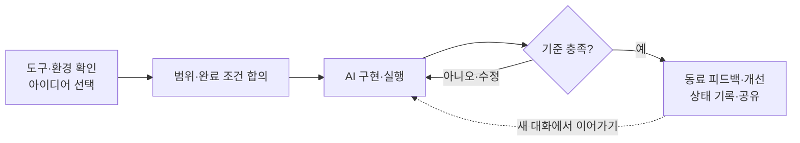
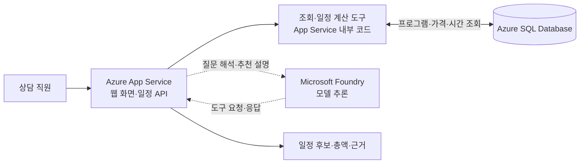
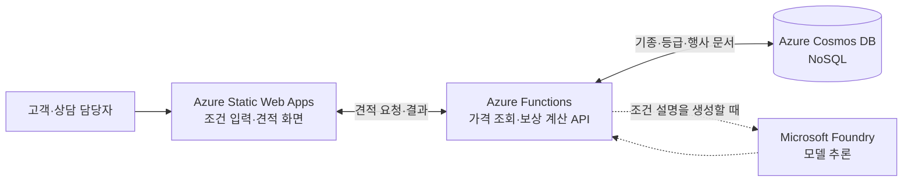
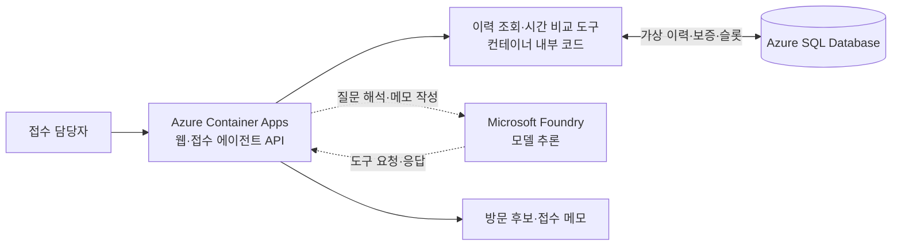
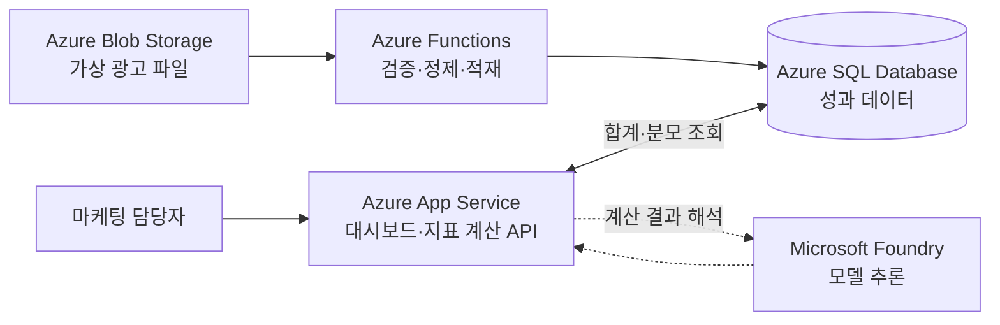
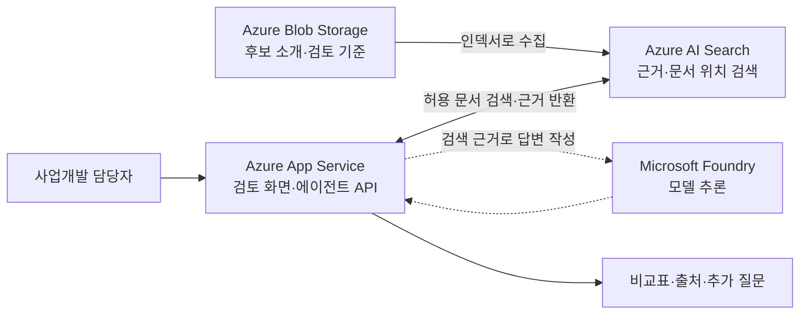

## 1. 오늘 할 일

제시하는 **업무 아이디어 5개 중 하나를 선택**하고, 자연어로 제작을 요청합니다. 직접 실행하고 동료의 의견을 듣고 수정합니다. 웹앱·업무 도구·에이전트 등 결과물 형태와 추가 기능은 자유롭게 정합니다. 정해진 코드를 복사하거나 빈 함수를 채우는 수업이 아니라 **만들고 싶은 일을 구체적으로 설명하고, 결과를 확인하며 개선하는 방법**을 익히는 것이 목표입니다.



가져갈 것은 **직접 만든 결과물, 제작·수정에 사용한 요청, 업무에 적용할 아이디어**입니다. 발표·투표·시상 방식은 강사가 별도로 안내합니다.

## 2. 무엇으로 만들까요? — 강사 설명

### 제작 도구와 실행 서비스를 구분합니다

| 역할 | 하는 일 | 예 |
|---|---|---|
| **코딩 도구** | 내 요청으로 코드를 만들고 수정·실행 | GitHub Copilot, Copilot CLI, Codex CLI |
| **실행 모델** | 만든 에이전트가 사용자의 요청을 해석하고 도구를 선택 | Foundry에서 제공하는 모델 |
| **데이터·배포 서비스** | 데이터 저장, 여러 사람의 접속, 서비스 실행 | Azure SQL, Cosmos DB, App Service 등 |

**Azure 구독이 있다고 Copilot이나 Codex 이용권이 자동으로 생기지는 않습니다.** 코딩 도구의 사용 권한과 Azure에서 만든 결과물을 실행하는 권한·비용은 별개입니다.

### 도구 비교

아래는 “Azure에 연결되는 결과물을 무엇으로 만들 것인가”에 대한 비교입니다. 모두 Azure 포털 안에서 제공되는 도구라는 뜻은 아닙니다.

| 도구 | 장점 | 고려할 점 | 이번 워크숍에서의 판단 |
|---|---|---|---|
| **GitHub Copilot — VS Code Agent 모드** | 대화·파일·변경 내용을 한 화면에서 확인. 앱·도구·에이전트 제작 가능 | Copilot 사용 권한과 조직 정책 확인. 실행 환경 설치는 필요할 수 있음 | **비개발자 대상 기본 권장안** |
| **GitHub Copilot CLI** | 터미널에서 대화로 제작·실행. 편집기를 강제하지 않음 | CLI를 설치해도 사용 권한이 자동 제공되지는 않음. 파일 변경 확인에 익숙해져야 함 | 터미널 중심 진행을 원하는 경우 |
| **Codex CLI** | 자연어로 여러 파일 작성·수정·실행. Azure를 사용하는 코드도 제작 가능 | 별도 지원 플랜 또는 API 인증·과금과 고객 정책 확인 | 고객이 승인한 Codex 환경이 있으면 대안 |
| **Copilot Studio** | 에이전트·업무 흐름 제작, 연결·게시 기능 제공 | Power Platform 환경·권한·라이선스 준비. 자유 코드 제작과는 다른 방식 | 관리형 에이전트 제작 방식의 비교 대상 |
| **Power Apps의 Copilot** | 업무 데이터와 입력·조회 앱을 빠르게 구성 | Dataverse·환경 권한·기능 지원 지역 확인. 앱 중심 | 업무 앱 제작 방식의 비교 대상 |

**권장:** GitHub Copilot의 VS Code Agent 모드. 이유는 참가자가 파일·변경 내용·실행 결과를 확인하기 쉬운 구성이라는 점입니다. **Copilot이 이미 있다고 가정하지 않으며, 이용권 확보가 어려우면 승인된 Codex 환경 등과 비교해 강사가 최종 도구를 지정합니다.** 참가자가 각자 다른 도구를 골라 시작하지 않습니다.

사용량이 제한된 무료·체험 플랜만으로 전체 실습이 가능하다고 보장하지 않습니다. 실제로 첫 파일 생성·수정까지 해보고 기능·잔여 사용량을 확인합니다. 제품별 조건은 [설치 안내의 공식 문서](docs/setup.md)를 참고합니다.

## 3. 사전 준비 — 고객 환경에서 확인할 것

**구독·권한·정책은 미리 확보하고, 개별 서비스는 필요할 때 만듭니다.** Foundry와 DB를 전원에게 사전 생성시키는 것이 아닙니다.

| 확인 항목 | 고객 담당자·강사가 준비할 내용 | 준비 완료 기준 |
|---|---|---|
| **실습 도구·계정·라이선스** | 강사가 지정한 도구, 참가자 계정과 사용 권한, 부족 시 확보 방식 | 실제 참가자 계정으로 제작 요청이 동작 |
| **고객 Azure 구독·테넌트** | 실습에 사용할 구독·디렉터리, 비용 부담 주체 | 담당자가 사용할 구독을 명확히 안내 |
| **생성·접근 권한** | 실습 전용 리소스 그룹 범위, 참가자 직접 생성 또는 관리자 지원 방식 | 필요한 생성·사용·역할 할당 요청을 처리할 담당자 확보 |
| **비용·지역·정책** | 예산 한도, 사용 가능한 서비스·지역, 모델 할당량, 초과 시 처리 | 승인 범위와 중단·정리 방법 안내 |
| **네트워크·설치 정책** | 코딩 서비스·패키지·Azure 접속, 확장·CLI 설치, 사설 접속 필요 여부 | 고객 PC와 사내망에서 설치·로그인 확인 |
| **교육용 데이터·공유 범위** | 합성 데이터 사용, 소스와 결과물의 공개 가능 범위 | 실제 고객정보·비밀 값 없이 진행 가능 |

구독 전체 관리자 권한을 참가자 모두에게 주지 않습니다. 필요한 권한은 지정 범위로 제한합니다. 예산 알림은 자동 과금 차단 장치가 아니므로 운영자가 사용량을 확인합니다.

**참가자:** 지정된 도구에 로그인하고 작업 폴더를 만들 수 있으면 공통 실습을 시작합니다. Python·Node.js·DB 드라이버 등은 선택한 도구·구현에 필요한 것만 설치합니다.

## 4. 아이디어 5개 중 하나 선택 — 강사 소개

<a id="어떤-에이전트를-만들까요"></a>

공식 사업 사이트·기사에서 착안한 **교육용 아이디어**입니다. 실제 회사 시스템·가격·정책을 재현하지 않습니다. 하나를 선택한 뒤 기능과 결과물 형태를 발전시키세요.

| 주제 | 해결할 업무 | 만들 수 있는 것 | 첫 요청 예시 |
|---|---|---|---|
| **[워커힐 — 고객 일정 제안](#architecture-itinerary)** | 방문 시간·예산·취향에 맞는 프로그램 조합 | 일정 비교 앱, 제안서 생성 도구, 상담 에이전트 | “가상 호텔 프로그램으로 예산과 시간에 맞는 일정 두 가지를 비교해줘.” |
| **[민팃 — 중고폰 판매 상담](#architecture-resale)** | 기종·가정 등급·회수 방법별 조건 설명 | 예상 금액 비교 도구, 상담 에이전트 | “가상 중고폰 가격으로 판매 방법과 예상 금액을 비교하고 확인할 조건을 알려줘.” |
| **[SK스피드메이트 — 접수 준비](#architecture-service)** | 정비 이력과 방문 조건을 한눈에 정리 | 이력 화면, 접수 메모 도구, 상담 준비 에이전트 | “가상 차량 이력을 정리하고 방문 전에 확인할 질문을 만들어줘.” |
| **[인크로스 — 캠페인 분석](#architecture-campaign)** | 광고 채널별 성과 비교와 후속 분석 | 성과 대시보드, 지표 계산 도구, 분석 에이전트 | “가상 광고 실적의 채널별 성과를 계산하고 더 살펴볼 항목을 보여줘.” |
| **[SK인텔릭스 — 파트너 검토](#architecture-partners)** | 해외 후보의 역량·근거·미확인 정보 비교 | 후보 비교 도구, 미팅 준비 에이전트 | “가상 파트너 후보를 비교하고 확인되지 않은 정보와 미팅 질문을 정리해줘.” |

[각 아이디어의 공식 자료·기사 근거](docs/sources.md)

**지금 할 일:** 선택한 주제와 “누가 어떤 상황에서 사용할지”를 한 문장으로 정합니다. DB 테이블이나 개발 언어부터 고를 필요는 없습니다.

### 시나리오별 Azure 참조 아키텍처

아래는 **Azure로 확장할 때의 설계 예시이며 배포된 구현이 아닙니다.** 로컬에서 먼저 만들고 필요한 구성만 선택합니다. 실선은 기본 요청·데이터 경로, 점선은 AI를 추가할 때의 선택 연결입니다. 모델의 도구 요청은 서버 코드가 검증·실행하며 브라우저가 DB·모델 키를 직접 보유하지 않습니다.

<a id="architecture-itinerary"></a>

#### 01. 고객 일정 제안 — 조건을 계산하고 추천 이유 설명

**업무 흐름:** 방문 조건 입력 → 프로그램·요금 조회 → 시간·예산 검증 → 일정 후보와 근거 표시.



**선택 이유:** 프로그램·요금·일정의 관계는 SQL로 관리하고 시간·예산은 코드로 계산합니다. Foundry는 대화·추천 설명이 필요할 때 추가하며 실제 예약·재고 차감은 하지 않습니다.

<a id="architecture-resale"></a>

#### 02. 중고폰 판매 상담 — 혜택 조건을 검증하는 견적 도구

**업무 흐름:** 가상 기종·등급·판매일 입력 → 가격·행사 조건 조회 → 중복·기간 검증 → 예상 금액과 미확인 조건 표시.



**선택 이유:** 기종별 속성과 다양한 행사 조건을 JSON 문서로 관리하는 참조안입니다. 관계형 관리가 더 적합하면 SQL로 바꿀 수 있으며, 금액 계산은 Functions가 수행하고 실제 기기 평가·보상 지급은 제외합니다.

<a id="architecture-service"></a>

#### 03. 접수 준비 — 이력과 방문 후보를 연결하는 에이전트

**업무 흐름:** 가상 차량 ID와 희망일 입력 → 이력·보증 조건 조회 → 가용 시간 비교 → 접수 메모와 담당자 확인 질문.



**선택 이유:** 별도 에이전트 런타임과 도구를 컨테이너로 운영하는 참조안입니다. 단순 웹 API라면 App Service로 통합할 수 있으며 보증 확정·차량 진단·예약 변경은 사람이 처리합니다.

<a id="architecture-campaign"></a>

#### 04. 캠페인 분석 — 적재·계산·해석을 분리

**업무 흐름:** 가상 광고 파일 적재 → 단위·중복 확인 → 같은 기간의 지표 계산 → 채널 비교 → 추가 분석 질문.



**선택 이유:** 파일 원본과 조회용 데이터를 분리하고 수치는 SQL·코드로 계산합니다. Foundry는 검산을 대신하지 않고 해석과 후속 질문을 돕습니다. 실제 광고 집행·예산 변경은 제외합니다.

<a id="architecture-partners"></a>

#### 05. 파트너 검토 — 문서 근거를 찾아 비교

**업무 흐름:** 가상 후보 소개·검토 기준 적재 → 근거 검색 → 동일 기준 비교 → 누락 정보와 실사 질문 정리.



**선택 이유:** 문서가 여러 개일 때 AI Search로 관련 근거를 찾는 참조안입니다. 작은 정형 목록이면 SQL이나 파일로 시작해도 됩니다. 미확인 정보는 0점으로 간주하지 않으며 최종 계약 판단은 사람이 합니다.

**공통 운영 요소:** Microsoft Entra ID로 사용자 인증, 지원되는 연결에는 Managed Identity와 최소 권한, 필요한 비밀은 Azure Key Vault, 실행·오류 관찰은 Application Insights를 사용합니다. 운영 배포에는 데이터 권한·네트워크·비용·승인 경계를 별도로 설계하며 위 그림만으로 운영 요건이 충족되지는 않습니다.

## 5. 실습 시작 — 시작 템플릿과 코딩 도구

1. 이 저장소의 `starter` 폴더를 복사해 내 작업 폴더로 만듭니다.

저장소를 내려받지 않았다면 먼저 실행합니다.

```powershell
Set-Location $HOME\Documents
git clone https://github.com/SookBongnaver/MS_WS_Vibecoding.git
Copy-Item .\MS_WS_Vibecoding\starter -Destination .\MyVibeProject -Recurse
```

2. VS Code에서 **File → Open Folder**로 `MyVibeProject`를 엽니다.
3. 강사가 지정한 경로 하나로 코딩 도구를 시작합니다.

| 지정 도구 | 시작 방법 |
|---|---|
| GitHub Copilot — VS Code | Chat을 열고 **Agent 모드** 선택, 지정 GitHub 계정으로 로그인 |
| GitHub Copilot CLI | 이 폴더에서 터미널을 열고 `copilot` 실행, 안내에 따라 로그인 |
| Codex CLI | 이 폴더에서 터미널을 열고 `codex` 실행, 승인된 방식으로 로그인 |

설치되지 않았으면 [도구별 설치·로그인 안내](docs/setup.md)의 지정 경로만 따릅니다. 오류가 나면 관리자 정책을 해제하지 말고 강사에게 알려주세요.

### starter 폴더에 들어 있는 것

```text
AGENTS.md    AI가 따르는 작업 규칙 — 질문 먼저, 기능 3개 이내, 합성 데이터만
docs/        AI가 채우는 문서 2개 — 무엇을 만들까 / 어떻게 만들까
.github/     GitHub Copilot용 같은 규칙
```

**빈 폴더에서 시작하지 않는 이유:** AI가 이 규칙을 읽고 **바로 코딩하는 대신 먼저 질문하고, 만들 범위를 정리해 보여줍니다.** 문서는 여러분이 쓰는 것이 아니라 AI가 채우고, 여러분은 읽고 확인합니다.

여기에 **완료 조건 정하기 → 실제 실행 결과로 수정하기 → 다음 대화에서 이어가기**를 더합니다. AI에게 지시문만 주는 대신, 판단 기준과 피드백을 제공하는 하네스 엔지니어링의 기본을 경험합니다. 지침 파일 자체가 도구 권한·보안을 강제하지는 않습니다.

**코딩 도우미에 입력**

```text
AGENTS.md를 먼저 읽고 그 규칙대로 진행해줘. 현재 폴더에 어떤 파일이 있는지 확인해줘. 아직 파일 수정이나 설치는 하지 마.
```

**확인:** 도구가 `AGENTS.md`와 `docs/` 폴더를 인식합니다.

## 6. 아이디어를 구체화하고 첫 버전 만들기

아래 대괄호를 선택한 아이디어에 맞게 바꿔 입력합니다.

```text
나는 [사용할 사람]을 위한 [선택한 주제]를 만들고 싶어. 사용자가 [입력할 내용]을 주면 [원하는 결과]를 보여주면 좋겠어. AGENTS.md의 순서대로 진행해줘. 먼저 질문부터 해줘. 문서의 완료 기준에 정상 입력, 조건 하나 변경, 정보 누락의 세 가지 사례를 적어줘. 각 사례는 실제로 넣어볼 입력과 기대 결과가 있어야 해.
```

AI가 질문을 마치면 `docs/1-무엇을만들까.md`를 채웁니다. **열어서 읽고 확인하세요.**

- 내가 원하는 게 맞나요?
- 첫 버전 기능 3개가 적절한가요?
- 빠진 조건이 있나요?
- 세 가지 사례의 기대 결과가 내 업무 기준과 맞나요?

고칠 부분이 있으면 말합니다. 예: “예산을 넘으면 어떻게 할지도 넣어줘.”

확인이 끝나면:

```text
문서 내용이 맞아. docs/2-어떻게만들까.md를 채우고 가장 단순한 방법으로 첫 기능을 만들어줘. 끝나면 내가 직접 실행할 방법을 순서대로 알려줘.
```

**확인:** 문서 2개가 채워지고 실제 파일이 생성됩니다. 화면·언어·기능이 옆 사람과 달라도 괜찮습니다.

## 7. 직접 실행하고 수정하기

1. 코딩 도우미가 사용할 수 있는 도구로 먼저 확인하도록 요청합니다.

```text
합의한 세 가지 사례를 실제로 실행해서 확인해줘. 승인된 환경에서 기존 실행 명령·테스트를 사용하고, 브라우저 도구가 있으면 실제 입력과 클릭까지 확인해줘. 기대와 다르면 코드를 수정하고 같은 사례를 다시 실행해줘. 통과시키려고 기대 결과를 임의로 낮추거나 바꾸지는 마. 사용한 명령·실제 결과·성공/실패/미실행을 docs/2-어떻게만들까.md에 남겨줘. 도구나 권한이 없어 못한 부분은 구분하고 내가 확인할 방법을 알려줘.
```

2. 필요한 도구가 없으면 설치·권한을 임의로 늘리지 않습니다. 모의 응답이나 코드 검토만 한 결과는 실제 실행과 구분합니다.
3. 참가자도 안내된 위치·명령·로컬 주소에서 실행해봅니다. AI가 기록한 결과와 화면·파일이 같은지 확인합니다.
4. 오류나 불편한 점이 있으면 아래처럼 설명합니다.

```text
내가 한 행동: [입력 또는 클릭]. 기대한 결과: [원하는 동작]. 실제 결과: [현상 또는 비밀 값을 제거한 오류 메시지]. 원인을 설명하고 수정해줘. 기존에 잘 되던 기능은 유지해줘. 수정 후 같은 상황을 다시 확인할 방법을 알려줘.
```

**확인:** “완료했다”는 답변이 아니라 실행 화면·파일·계산 결과가 있습니다. “조건을 바꾸면 다시 계산해줘”처럼 개선도 자연어로 요청합니다.

## 8. 필요한 기능과 서비스를 추가하기

만들다가 필요해지면 동작을 설명합니다. 기술 선택은 그다음입니다.

| 추가하고 싶은 기능 | 검토할 방법 | Azure를 사용하는 경우의 예 |
|---|---|---|
| “다시 열어도 기억하게 해줘” | 로컬 저장이면 충분한지, 공유 저장이 필요한지 | Blob Storage, SQL, Cosmos DB |
| “여러 사람이 같은 데이터를 쓰게 해줘” | 데이터 구조·사용자 권한·동시 수정 | SQL, Cosmos DB와 인증 |
| “AI가 질문을 이해하고 도구를 써서 처리하게 해줘” | 실행 모델·도구 호출·접근 범위 | Foundry 모델 연결 |
| “동료가 접속해서 쓰게 해줘” | 실행 방식·인증·승인된 공유 범위 | App Service, Static Web Apps 등 |

이 목록은 제품을 모두 설치하라는 뜻이 아닙니다. 각 서비스가 모든 구현에 바로 호환되는 것도 아닙니다.

```text
이제 [추가 기능]이 필요해. 가장 단순한 방법과 외부 서비스가 필요한 방법을 비교해줘. 고객이 이미 제공한 환경을 쓸 수 있는지 먼저 확인해줘. 새 서비스가 필요하면 구독·권한·지역·비용·정리 방법을 설명해줘. 생성·유료 호출·외부 전송 전에는 승인을 받아줘.
```

**에이전트를 선택했다면:** 생성된 프로그램이 실제 모델을 호출하고, 허용된 도구를 사용하는지 확인합니다. 코딩 도우미가 직접 답한 것이나 모의 응답만으로 에이전트가 완성됐다고 판단하지 않습니다.

Azure 연결이 필요해지면 [공식 기술 문서](docs/sources.md)를 참고합니다. 실제 구독·테넌트 접근과 비용은 사전 준비에서 정한 범위를 따릅니다.

## 9. 동료와 논의하고 개선하기

동료에게 실제로 사용해보게 합니다. 조건을 하나 바꾸거나 일부 입력을 생략해보세요.

**논의:** 무엇이 유용한가요? 어디서 막혔나요? 결과를 믿으려면 어떤 근거가 더 필요한가요?

```text
동료가 사용하면서 [불편한 점]을 발견했어. [기대한 동작]이 되도록 개선해줘. 현재 권한을 넓히거나 실제 업무 시스템을 변경하지 마. 개선 후 기존 정상 동작과 새 요청을 함께 확인할 방법을 알려줘.
```

기능 하나를 개선하고 다시 실행합니다. 보여주기 좋은 화면만큼 실제 결과와 근거도 확인합니다.

## 10. 결과 공유와 마무리

**해결할 업무 → 작동 장면 → 개선한 점 → 남은 한계** 순서로 공유합니다. 발표·투표·시상은 별도 안내를 따릅니다.

마지막으로 **새 대화에서 이어가기**를 해봅니다. 현재 작동 상태·미완료·다음 작업 하나를 `docs/2-어떻게만들까.md`에 기록하게 한 뒤, 같은 프로젝트에서 새 대화를 열고 입력합니다.

```text
AGENTS.md, docs/1-무엇을만들까.md, docs/2-어떻게만들까.md와 현재 코드를 읽어줘. 작동하는 것, 마지막 확인 결과, 남은 문제와 다음 작업 하나를 요약해줘. 추측하지 말고 기록이 없는 부분은 알려줘. 아직 코드는 바꾸지 마.
```

이전 작업 상태를 올바르게 파악하면 다음 작업을 요청합니다. 대화가 바뀌어도 같은 프로젝트를 이어서 만들 수 있는지 확인하는 단계입니다.

- 코드와 교육용 결과물을 보관합니다. 비밀번호·API 키·토큰·개인정보는 공유하지 않습니다.
- 실제 예약·지급·광고 집행·계약은 연결하지 않고 초안·모의 동작으로 제한합니다.
- 생성한 실습 리소스는 담당자와 확인해 정리합니다. 공동 리소스는 임의 삭제하지 않습니다.
- 프로그램을 종료해도 클라우드 비용이 모두 중단되는 것은 아닙니다.

---

### 참고 샘플

기존 과제와 진행 순서는 그대로 사용합니다. 아래는 필요할 때 실행하거나 변형해보는 **추가 샘플**이며 필수 실습이 아닙니다.

| 샘플 | 데이터 흐름 | 실행 |
|---|---|---|
| **주말 한 장 — 나들이 코스·알림** | 서울 공개 데이터 → 코스 제안·장소 고정 → Teams/Discord 알림·예매 링크 | [실행 방법과 실제 화면](samples/weekend-card/README.md) |

### 상세 참고 — 필요한 경우만 열기

[설치·로그인](docs/setup.md) · [문제 해결](docs/troubleshooting.md) · [공식 자료](docs/sources.md)

**자료 상태:** 주말 한 장 웹앱에는 실제 실행 화면이 포함됩니다. 모델·알림은 연결 코드를 제공하며 실제 고객 계정 호출·발송은 미확인입니다. 코딩 도구별 제작 화면·Azure 구성 화면은 아직 미촬영입니다.
