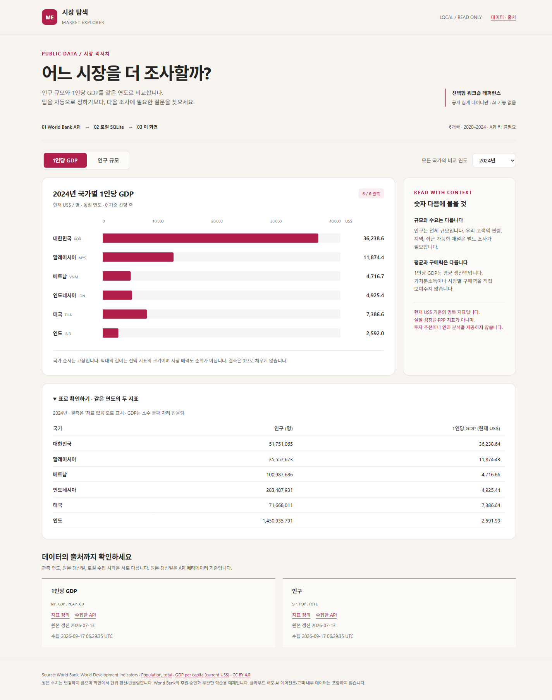

# 샘플 01. 공공데이터 시장 탐색 웹앱

[워크숍으로 돌아가기](../../README.md)

**공개 데이터를 한 번 조회하는 데서 끝내지 않고, 저장하고 다시 비교할 수 있는 웹앱입니다.**
기존 워크숍에 추가한 선택 샘플입니다. 기존 다섯 과제나 자유 제작 방식을 대체하지 않습니다.



2026-09-17에 공개 API 데이터를 실제로 적재해 실행한 화면입니다. 데이터는 갱신될 수 있습니다.

## 무엇이 동작하나요?

```text
World Bank 공개 API → 응답 검증 → SQLite 적재 → 로컬 웹앱 조회
```

- 대한민국·말레이시아·베트남·인도네시아·태국·인도, **2020~2024년**.
- **인구·1인당 GDP** 두 지표, 총 60개 관측치 키.
- 연도와 지표를 바꿔 같은 연도로 비교하고, 표에서 수치를 확인.
- 데이터 기준 연도·API 원본 갱신일·로컬 수집 시각을 각각 표시.
- 값이 없으면 `자료 없음`으로 표시하며 0으로 대체하지 않음.

**AI 모델·Azure 구독·API 키는 필요하지 않습니다.** 이 버전은 데이터 웹앱이며 AI 에이전트가 아닙니다. 클라우드 배포도 포함하지 않습니다.

## 1. 샘플 폴더 열기

Python **3.11 이상**이 필요합니다. 외부 Python 패키지는 설치하지 않습니다.

저장소를 내려받고, 저장소 최상위 폴더에서 PowerShell을 엽니다.

```powershell
Set-Location .\samples\public-data
python --version
```

`python`을 찾지 못하면 Python 설치와 PATH를 확인합니다. Windows Python Launcher를 쓰는 환경은 아래 명령의 `python` 대신 `py -3`을 사용해도 됩니다.

## 2. 공개 데이터 적재

```powershell
python app.py ingest
```

World Bank API로 공개 국가 집계값만 요청합니다. 로그인이나 개인 데이터 전송은 없습니다. 사내망에서 접근이 막히면 허용된 경로를 확인하세요.

**정상 결과:** `"rows": 60`, 미제공 건수 `missing`, 출처 URL과 수집 시각이 출력되고 `data\market.sqlite3`가 만들어집니다.

처음 실행할 때 인터넷이 필요합니다. 이후 웹 조회는 적재된 SQLite를 읽습니다. 갱신할 때 같은 명령을 다시 실행합니다.

- 국가·지표·연도의 같은 키는 갱신하므로 중복 적재되지 않습니다.
- API 응답 두 개를 모두 검증한 뒤 한 트랜잭션으로 적재합니다.
- API 오류나 데이터 구조 변경이 있으면 실패 이유를 출력하고 기존 데이터를 보존합니다.
- 예제는 범위를 작게 고정합니다. 국가·기간을 늘린다면 페이지 처리와 건수 검증도 함께 바꿔야 합니다.

## 3. 웹앱 실행

```powershell
python app.py serve
```

터미널을 켜둔 채 브라우저에서 **http://127.0.0.1:8765**를 엽니다. HTML 파일을 직접 여는 방식이 아닙니다.

포트를 이미 사용 중이면:

```powershell
python app.py serve --port 8767
```

이 경우 **http://127.0.0.1:8767**로 접속합니다. 서버는 자신의 PC에만 열리며 회사 전체에 공개되지 않습니다. 종료는 실행 터미널에서 **Ctrl+C**입니다.

## 4. 직접 사용

1. `2024년`과 `1인당 GDP`를 선택해 여섯 국가를 비교합니다.
2. `인구 규모`로 전환해 다른 지표를 봅니다.
3. 연도를 바꾸면 차트와 표가 함께 바뀌는지 확인합니다.
4. 아래 `데이터의 출처까지 확인하세요`에서 수집 정보와 원본 링크를 확인합니다.

1인당 GDP는 **현재 US$ 기준 명목 지표**입니다. 실질 성장률·PPP·소비자의 구매력을 직접 나타내지 않으며, 인구와 함께 봐도 시장 진출 판단의 충분한 근거가 되지는 않습니다.

## 5. 코딩 도우미로 변형

먼저 샘플 폴더를 별도 프로젝트로 복사하고 강사가 지정한 코딩 도구에서 시작합니다. 코드 설명을 읽은 뒤 원하는 기능만 추가하세요.

```text
app.py와 index.html을 읽고 데이터가 API에서 SQLite를 거쳐
화면에 표시되는 구조를 설명해줘. 아직 코드는 바꾸지 마.
이 앱에서 사용자가 국가 두 개를 골라 비교하도록 바꾸고 싶어.
같은 연도 비교와 누락 값 처리, 출처 표시를 유지하는 변경 계획을 제안해줘.
```

추가 아이디어:

- **다른 공개 지표:** 이용 조건·단위·누락 처리를 확인한 지표를 추가.
- **데이터 적재 개선:** 갱신 이력과 이전 값의 차이를 표시.
- **분석 에이전트:** 승인된 실행 모델을 연결하고, 같은 DB를 읽는 제한된 조회 도구로 질문에 답하기. 별도 인증·비용과 도구 구현이 필요하며 현재 제공 기능은 아님.

## 파일과 확인 명령

| 파일 | 역할 |
|---|---|
| `app.py` | API 수집·검증·SQLite·읽기 전용 로컬 서버 |
| `index.html` | 연도·지표 선택, 차트·표·출처 표시 |
| `test_app.py` | 응답 검증·누락·재적재·실패 보존·조회 경로 확인 |
| `screenshot.png` | 실제 실행 화면 |
| `data\` | 실행 시 생성되는 로컬 DB, Git에서 제외 |

```powershell
python -m unittest -q
```

테스트는 별도의 합성 입력으로 수행하며 공개 API나 실제 적재 데이터에 의존하지 않습니다. 합성 테스트 값이 앱에 대체 데이터로 들어가지는 않습니다.

## 출처와 이용 조건

**Source: World Bank, World Development Indicators.**

- [Population, total — SP.POP.TOTL](https://data.worldbank.org/indicator/SP.POP.TOTL)
- [GDP per capita (current US$) — NY.GDP.PCAP.CD](https://data.worldbank.org/indicator/NY.GDP.PCAP.CD)
- [World Bank 데이터 이용 허가](https://datacatalog.worldbank.org/public-licenses)
- [Creative Commons Attribution 4.0](https://creativecommons.org/licenses/by/4.0/)

선택한 WDI 지표를 출처 표시와 함께 사용합니다. 원 수치는 유지하고 화면에서 단위 환산·반올림하며 한국어 항목명을 제공합니다. World Bank의 후원·승인을 받은 앱이 아닙니다. 다른 데이터로 확장할 때는 해당 데이터의 개별 이용 조건을 다시 확인하세요.
