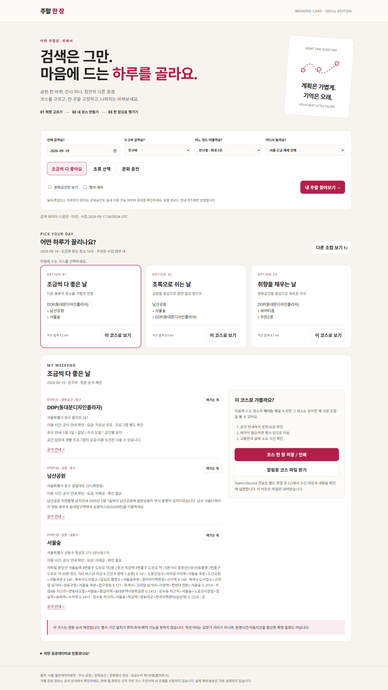

# 주말 한 장

**“이번 주말 뭐 하지?” — 조건을 고르면 코스를 만들고, 마음에 드는 장소는 남기고, 내 채널로 챙겨갑니다.**

[워크숍으로 돌아가기](../../README.md)

기존 워크숍에 더하는 **선택 샘플**입니다. 다섯 과제·스타터·진행 순서를 바꾸지 않습니다.



## 서비스 이야기

친구와 반나절을 보내고 싶은데 검색 결과만 많습니다. 이 서비스는 가능한 장소를 모아 **서로 다른 하루의 후보**를 보여줍니다.

1. **날짜·지역·취향 선택** — 초록 산책, 문화 충전, 조금씩 섞은 코스.
2. **코스 비교** — 장소와 방문 순서를 보고 마음에 드는 안 선택.
3. **“여기는 꼭”** — 한 장소를 고정한 채 다른 조합 보기.
4. **공식 안내 확인** — 운영·요금·행사 회차와 예매 링크 확인.
5. **한 장으로 저장 또는 알림** — Teams·Discord 연결 후 내용을 승인해 전송.

예약 API를 연동하지 않았습니다. **예매 안내 링크로 이동해 사람이 예약을 완료**합니다. 홈페이지밖에 없는 장소는 공식 안내만 제공합니다.

## 현재 되는 것과 추가 연결

| 경로 | 기능 | 필요한 환경 |
|---|---|---|
| **웹앱** | 조건별 코스·고정·재추천·인쇄·알림 요청 파일 | Python 3.11+, 별도 패키지 없음 |
| **규칙 기반 알림 초안** | 선택 코스를 정해진 형식으로 정리 | 같은 공개 데이터 DB, AI 모델 불필요 |
| **AI 에이전트** | 실제 모델이 DB 후보 조회 도구를 호출하고 코스 선택·설명 | 지원되는 Foundry 모델·Azure CLI 인증 |
| **Teams / Discord 알림** | 수신처와 전문 확인 후 webhook 전송 | 자신의 승인된 채널·webhook, 필요 시 인증 토큰 |

웹앱을 켰다고 AI나 알림이 자동 연결되지 않습니다. **웹·공개 데이터 적재는 실제 실행했습니다. 모델·Teams·Discord는 연결 코드를 제공하며, 실제 고객 연결·발송은 아직 수행하지 않았습니다.** 테스트의 알림 응답은 모의입니다.

### 서비스 흐름과 Azure 확장 참조

**서비스 흐름:** 공개 데이터 수집 → 날짜·취향별 코스 제안 → 장소 고정·재추천 → 알림 초안 확인 → 승인 후 채널 전송 → 공식 링크에서 사용자 예약.

```mermaid
flowchart LR
    P["서울 공공데이터 API"] --> F["Azure Functions<br/>주기·수동 수집"]
    F --> D[("Azure Cosmos DB<br/>장소·행사·출처")]
    U["사용자"] --> A["Azure App Service<br/>코스 화면·에이전트 API"]
    A <-->|조건별 후보 조회| D
    A -.->|AI 추천을 사용할 때| M["Microsoft Foundry<br/>모델 추론"]
    M -.-> A
    A --> C{"알림 내용·수신처<br/>사용자 승인"}
    C -->|승인| L["Azure Logic Apps<br/>알림 전달"]
    L --> T["Teams 또는 Discord"]
    A --> B["공식 안내·예매 링크<br/>사용자가 예약"]
```



**현재 구현과의 차이:** 현재 코드는 로컬 Python·SQLite이며 위 Azure 리소스에 배포된 것이 아닙니다. Cosmos DB는 다양한 장소·행사 문서 저장, Functions는 수집, App Service는 화면·API, Logic Apps는 Teams 커넥터 또는 승인된 Discord HTTPS 전송을 맡기는 확장안입니다. 자동 예약은 포함하지 않습니다.

## 1. 먼저 웹앱 실행

저장소를 내려받고 최상위 폴더의 터미널에서:

```powershell
Set-Location .\samples\weekend-card
python --version
python app.py seed
python app.py serve
```

브라우저에서 **http://127.0.0.1:8768**을 엽니다. 서버 터미널은 켜둡니다. 종료는 **Ctrl+C**입니다.

- `seed`는 함께 제공한 **실제 공개 데이터 스냅샷**을 SQLite에 적재합니다. 처음 실행에는 인터넷·API 키가 필요 없습니다.
- 기존 DB가 있으면 실수로 덮어쓰지 않습니다. 교체할 때만 `python app.py seed --replace`를 사용합니다.
- 다른 포트를 쓰려면 `python app.py serve --port 8769`를 실행하고 해당 주소로 접속합니다.
- `index.html`을 직접 열지 않습니다. 웹앱은 로컬 서버를 통해 DB를 읽습니다.

## 2. 서비스를 사용해보기

1. `서울·근교 예제 전체`, `조금씩 다 좋아요`로 시작합니다.
2. 코스 하나를 보고 장소의 **여기는 꼭**을 누릅니다.
3. **다른 조합 보기**를 눌러 고정 장소가 유지되는지 확인합니다.
4. **문화공간만 보기**로 바꿉니다. 고정한 공원과 충돌하면 해제하거나 조건을 바꾸라는 안내가 나옵니다.
5. **코스 한 장 저장 / 인쇄**로 브라우저의 PDF 저장을 사용할 수 있습니다.
6. **알림용 코스 파일 받기**로 `weekend-request.json`을 받습니다. 이 버튼은 **발송하지 않습니다.**

코스가 없으면 다른 날짜·지역을 선택합니다. 후보가 없는 이유를 가짜 장소로 채우지 않습니다.

## 3. 데이터는 어디서 오나요?

서울 열린데이터광장의 **공식 공개 예제 API**를 사용합니다. TourAPI 인증키가 없는 상태에서도 실습할 수 있도록 선택한 별도 데이터 경로입니다.

| 자료 | 예제 범위 | 공식 출처 |
|---|---|---|
| 주요 공원 | 첫 5건 | [공원 정보](https://data.seoul.go.kr/dataList/OA-394/S/1/datasetView.do) |
| 문화공간 | 첫 5건 | [문화공간 정보](https://data.seoul.go.kr/dataList/OA-15487/S/1/datasetView.do) |
| 문화행사 | 첫 5건 | [문화행사 정보](https://data.seoul.go.kr/dataList/OA-15486/S/1/datasetView.do) |

**15건은 서울 전체 목록이 아닙니다.** 목록 순서에 따라 먼 미래의 행사만 포함될 수도 있습니다. 화면의 방문 날짜에 맞는 행사만 사용하므로 이번 주말 행사가 한 건도 없을 수 있습니다. 공식 예제 제한을 우회해 전체 목록을 수집하지 않습니다.

실제 API로 다시 적재하려면 새 터미널에서:

```powershell
python app.py refresh
python app.py inspect
```

정상 출력은 `공개 API 15건 적재`입니다. 출처·범위·수집 시각은 DB와 화면에 남습니다. 제공 목록은 변경될 수 있습니다.

예제 API는 기관이 제공하는 HTTP 주소를 사용하며 키·개인정보를 보내지 않습니다. 고객 정책이 HTTP 접근을 막으면 동봉 스냅샷으로 실습하고, 정책을 해제하지 않습니다. 본인 키가 필요한 전체 데이터 연동은 공식 지원 경로·이용 조건을 확인해 별도로 구현해야 합니다.

**출처 표시:** 서울특별시, 서울 열린데이터광장, 주요 공원·문화공간·문화행사 정보. 개별 자료의 **공공누리 제1유형(출처표시)**을 확인했습니다. 원문 사진과 긴 소개문은 재배포하지 않고 필요한 사실 필드만 추출·정규화했습니다. 기관의 공식 서비스나 후원을 의미하지 않습니다.

## 4. 코스를 알림 초안으로 만들기

웹앱에서 받은 `weekend-request.json`을 이 샘플 폴더로 복사합니다. 개인화된 코스 파일은 Git에 올리지 않습니다.

```powershell
python agent.py draft --request .\weekend-request.json --mode rules
```

`data\preview.json`에 보낼 글이 저장됩니다. **규칙 기반이며 아직 AI도 발송도 아닙니다.**
다른 코스를 만들려면 `--output .\data\preview-02.json`처럼 새 파일명을 지정합니다.

웹에서 고르지 않고 취향만으로 시작하려면 `preferences.example.json`을 `preferences.local.json`으로 복사하고 날짜·조건을 수정합니다. 예시 날짜는 고정값이므로 현재 계획 날짜로 바꿉니다.

## 5. 실제 AI 에이전트로 선택하기 — 연결한 경우만

이 경로는 Codex·Copilot이 대신 답하는 것이 아니라 **독립 Python 프로그램이 Azure 모델을 호출**합니다.

1. 고객이 승인한 Foundry 모델 배포를 준비합니다. Azure OpenAI v1 Chat Completions·함수 호출을 지원해야 합니다.
2. Azure CLI에서 지정 테넌트로 로그인하고 해당 리소스의 추론 권한을 확인합니다.
3. 새 터미널에서 실제 v1 엔드포인트와 배포 이름을 지정합니다. 프로젝트 엔드포인트 `.../api/projects/...`는 사용하지 않습니다.

```powershell
az login --tenant YOUR-TENANT-ID
$env:AZURE_OPENAI_BASE_URL = "https://YOUR-RESOURCE.openai.azure.com/openai/v1/"
$env:AZURE_OPENAI_DEPLOYMENT = "YOUR-DEPLOYMENT"
python agent.py draft --request .\preferences.local.json --mode azure --output .\data\ai-preview.json
```

**진행:** 모델 요청 → `find_courses` 도구로 날짜·조건에 맞는 DB 후보 조회 → 유효한 코스 선택 → 알림 초안 생성. 모델이 없는 장소를 선택하면 실패 처리하고 발송하지 않습니다.

`weekend-request.json`을 사용한 경우 사용자가 이미 선택한 장소를 유지합니다. 공개 데이터의 수집 시점이 달라졌다면 웹에서 다시 확인하도록 안내합니다.

이 호출에는 모델 사용료가 발생합니다. 생성된 설명의 사실관계를 확인하세요. 모델 실패를 규칙 기반 성공으로 자동 대체하지 않습니다.

## 6. Teams 또는 Discord로 보내기

**웹훅은 수신 채널을 정하는 비밀 URL입니다.** 채널은 실제 사용자가 설정해야 합니다. 이 프로그램은 표시 이름만으로 수신자를 찾거나 본인 채팅을 자동 생성하지 않습니다.

### Teams

Teams **Workflows**에서 **When a Teams webhook request is received** 트리거와 Adaptive Card 게시 작업을 사용하는 흐름을 만듭니다. 자신의 승인된 채팅·채널을 대상으로 선택하고 실제 수신처를 확인합니다.

구형 Microsoft 365 Connector를 새로 만드는 경로는 사용하지 않습니다. [Microsoft 공식 안내](https://learn.microsoft.com/en-us/microsoftteams/platform/webhooks-and-connectors/how-to/add-incoming-webhook)를 따릅니다.

민감한 URL이 화면이나 명령 이력에 남지 않게 입력합니다.

```powershell
$secret = Read-Host "Teams Workflow URL" -AsSecureString
$env:TEAMS_WORKFLOW_URL = [System.Net.NetworkCredential]::new("", $secret).Password
Remove-Variable secret
python agent.py notify --preview .\data\ai-preview.json --channel teams --target-label "내가 지정한 테스트 채널"
```

테넌트 인증이 필요한 흐름은 올바른 대상의 bearer token을 `TEAMS_WORKFLOW_TOKEN` 환경 변수로 제공해야 합니다. 이 예제는 Teams용 토큰 발급을 자동 구현하지 않습니다. 정책상 토큰 발급이 안 되면 익명 허용으로 낮추지 말고 관리자에게 확인합니다.

### Discord

관리 권한이 있는 테스트 채널에서 webhook을 만들고 다음을 실행합니다. 채널 구성원 모두가 내용을 볼 수 있습니다.

```powershell
$secret = Read-Host "Discord Webhook URL" -AsSecureString
$env:DISCORD_WEBHOOK_URL = [System.Net.NetworkCredential]::new("", $secret).Password
Remove-Variable secret
python agent.py notify --preview .\data\preview.json --channel discord --target-label "내 테스트 채널"
```

### 전송 확인

프로그램은 **수신 채널 종류·표시 이름·메시지 전문**을 보여주고 `SEND <확인코드>` 입력을 기다립니다. 승인하지 않으면 보내지 않습니다. 외출 날짜·장소도 공유되므로 수신자를 직접 확인하세요.

중복 전송 방지를 위해 동일 초안·webhook에 대한 시도 기록을 남깁니다. 시간 초과는 전송 여부가 불명확하므로 수신 채널부터 확인합니다. 자동 재시도하지 않습니다. Teams HTTP 수락은 채널 게시 완료 보장이 아니므로 Workflow 실행 기록도 확인합니다.

현재는 **직접 실행 → 초안 확인 → 발송** 경로입니다. 매주 자동 발송이나 예약 봇은 설정하지 않았습니다. 주기 실행을 추가한다면 시간·수신처·공유 조건에 대한 별도 사용자 동의와 비밀 관리가 필요합니다.

## 워크숍에서 변형해보기

```text
이 샘플을 읽고 서비스 흐름을 설명해줘.
내가 고정한 장소를 유지하면서 두 번째 장소만 바꾸는 기능을 개선하고 싶어.
실제 데이터·수집 범위 표시·알림 전 확인은 유지해.
변경할 파일과 확인할 상황부터 제안해줘.
```

다른 아이디어: TourAPI로 한 지역 데이터 확대, 더 적은 이동 거리, 동행자별 코스 메모, 개인 Teams 알림 흐름. API 연동·날씨·실내 판별·이동시간은 현재 구현됐다고 가정하지 않습니다.

## 코드 구성

| 파일 | 역할 |
|---|---|
| `app.py` | 공개 데이터 수집·스냅샷·SQLite·로컬 HTTP |
| `planner.py` | 날짜·지역·거리·고정 조건으로 코스 제안 |
| `index.html` | 취향 선택·코스·핀·인쇄·요청 파일 |
| `agent.py` | 선택형 모델 호출·초안·확인 후 Teams/Discord 전송 |
| `snapshot.json` | 실제 공개 예제 자료 15건, 출처·수집 시각 포함 |
| `preferences.example.json` | 취향만으로 시작하는 입력 예시 |
| `test_app.py` | 데이터·코스·모의 모델·전송 승인·중복 방지 |

```powershell
python -m unittest -q
```

테스트는 실제 Teams·Discord에 메시지를 보내지 않으며 모델도 모의 응답으로 확인합니다.
