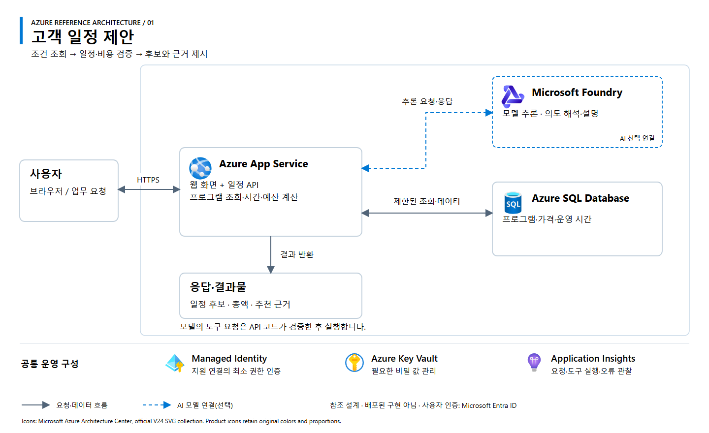

# 01. 고객 일정 제안

[워크숍 개요](../../README.md) · [아키텍처 원본 SVG](architecture.svg)

## 업무 범위

방문 시간·인원·예산에 부합하는 프로그램을 조합하고 일정 후보, 총액, 선택 근거를 제공하는 웹앱 또는 상담 에이전트입니다.

**처리 흐름:** 조건 입력 → 프로그램·가격 조회 → 시간·예산 검증 → 일정 후보·근거 반환.

## Azure 참조 아키텍처

**설계 상태:** 교육용 참조안이며 배포된 구현이 아닙니다. 실선은 요청·데이터 흐름, 파란 점선은 선택형 AI 연결입니다. 공통 운영 구성은 별도 설정이 필요합니다.

| 구성 | 역할 | 적용 기준 |
|---|---|---|
| Azure App Service | 웹 화면·일정 API·조회 및 계산 도구 | 웹앱과 API를 단일 서비스로 구성 |
| Azure SQL Database | 프로그램·가격·운영 시간 관리 | 관계형 데이터와 조건 조회 |
| Microsoft Foundry Models | 질문 해석·추천 설명 | 대화형 기능이 필요한 경우 추가 |

모델이 계산을 대신하지 않습니다. 서버 코드가 도구 요청과 인자를 검증하고, 조회 데이터로 시간 중복·예산·인원을 계산합니다. 실제 예약·재고 차감은 제외합니다.

## 입력·결과·완료 조건

| 구분 | 내용 |
|---|---|
| 입력 | 방문일, 이용 시간, 인원, 예산, 프로그램 선호 |
| 데이터 | 합성 프로그램·가격·운영 시간 |
| 결과 | 일정 후보, 총액, 추천·제외 근거, 추가 확인 사항 |
| 정상 입력 | 조건을 만족하는 일정과 코드로 계산한 총액 반환 |
| 조건 변경 | 예산·시간 변경 시 후보와 총액 재계산 |
| 정보 누락 | 필수 조건을 질문하거나 미확인으로 표시 |

**구현 선택:** 로컬 데이터와 화면으로 먼저 검증하고, 공유 데이터가 필요할 때 SQL을 연결합니다. 에이전트를 선택하면 실제 모델 호출과 도구 실행을 추가합니다.

## 참고

[워커힐 공식 사업 사례](https://www.sknetworks.co.kr/pr/news-room/BrjdW3ZhfZf8VUGd)에서 착안한 교육용 시나리오입니다. 실제 정책·가격을 재현하지 않습니다. 아이콘은 [Microsoft 공식 Azure V24](https://learn.microsoft.com/en-us/azure/architecture/icons/)를 사용하며, 상세 출처와 사용 조건은 [공식 자료](../../docs/sources.md)를 참조합니다.
