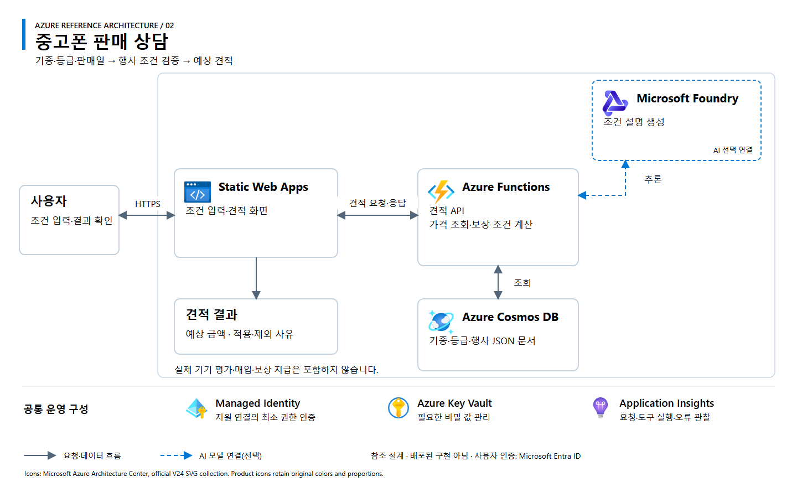

# 02. 중고폰 판매 상담

[워크숍 개요](../../README.md) · [아키텍처 원본 SVG](architecture.svg)

## 업무 범위

기종·가정 등급·판매일별 보상 조건을 검증하고 예상 금액과 판매 방법을 설명하는 웹앱 또는 상담 에이전트입니다.

**처리 흐름:** 조건 입력 → 가격·행사 문서 조회 → 중복·기간 조건 검증 → 예상 견적·적용 근거 반환.

## Azure 참조 아키텍처

**설계 상태:** 교육용 참조안이며 배포된 구현이 아닙니다. 실선은 요청·데이터 흐름, 파란 점선은 선택형 AI 연결입니다. 공통 운영 구성은 별도 설정이 필요합니다.

| 구성 | 역할 | 적용 기준 |
|---|---|---|
| Azure Static Web Apps | 조건 입력·견적 비교 화면 | 정적 웹 프런트엔드 |
| Azure Functions | 가격 조회·행사 조건 검증·보상 계산 | 서버 API와 결정적 계산 |
| Azure Cosmos DB for NoSQL | 기종·등급·행사 조건 JSON 문서 | 속성과 조건이 다양한 문서형 데이터 |
| Microsoft Foundry Models | 조건 해석·견적 설명 | 대화형 기능이 필요한 경우 추가 |

관계형 데이터 관리가 더 적합하면 Cosmos DB 대신 SQL을 선택할 수 있습니다. Static Web Apps와 Functions 연계는 선택 플랜의 지원 방식을 확인합니다. 실제 기기 평가·매입·보상 지급은 제외합니다.

## 입력·결과·완료 조건

| 구분 | 내용 |
|---|---|
| 입력 | 가상 기종·용량·가정 등급·판매 예정일·판매 방법 |
| 데이터 | 합성 가격·행사 기간·중복 적용 조건·회수 방식 |
| 결과 | 기준 금액, 적용 혜택, 예상 합계, 제외 사유 |
| 정상 입력 | 적용 가능한 조건만 반영해 예상 금액 계산 |
| 조건 변경 | 중복 불가 혜택을 추가하면 결합 거부 또는 대안 제시 |
| 정보 누락 | 등급·가격이 미확정이면 확정 견적 대신 추가 확인 안내 |

**구현 선택:** 화면·계산부터 시작하고 저장·대화 기능을 단계적으로 추가합니다. 모델이 금액이나 실제 진단 결과를 생성하지 않도록 계산·안내 경계를 분리합니다.

## 참고

[민팃 공식 사업 사례](https://www.sknetworks.co.kr/business/mintit)에서 착안한 교육용 시나리오입니다. 실제 가격·행사 정책을 재현하지 않습니다. 아이콘은 [Microsoft 공식 Azure V24](https://learn.microsoft.com/en-us/azure/architecture/icons/)를 사용하며, 상세 출처와 사용 조건은 [공식 자료](../../docs/sources.md)를 참조합니다.
