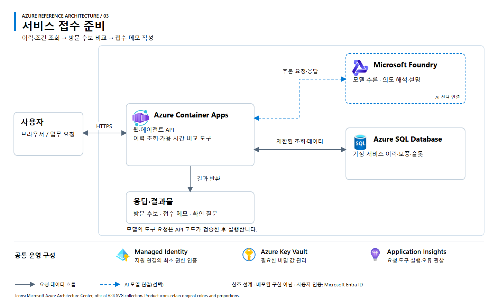

# 03. 서비스 접수 준비

[Workshop 개요](../../README.md) · [아키텍처 원본 SVG](architecture.svg)

## 업무 범위

가상 차량의 이력·보증 조건·방문 가능 시간을 조회하고 접수 메모와 담당자 확인 질문을 작성하는 웹앱 또는 업무 에이전트입니다.

**처리 흐름:** 대상·희망일 입력 → 이력·보증 조건 조회 → 가용 시간 비교 → 방문 후보·접수 메모 반환.

## Azure 참조 아키텍처

**설계 상태:** 교육용 참조안이며 배포된 구현이 아닙니다. 실선은 요청·데이터 흐름, 파란 점선은 선택형 AI 연결입니다. 공통 운영 구성은 별도 설정이 필요합니다.

| 구성 | 역할 | 적용 기준 |
|---|---|---|
| Azure Container Apps | 웹·에이전트 API와 조회·시간 비교 도구 | 사용자 정의 실행 환경을 컨테이너로 운영 |
| Azure SQL Database | 가상 이력·보증·가용 시간 관리 | 일관된 대상 ID와 관계형 조회 |
| Microsoft Foundry Models | 질문 해석·메모 작성 | 요청에 따른 도구 선택·응답이 필요한 경우 |

별도 컨테이너가 필요하지 않으면 App Service로 통합할 수 있습니다. 모델 요청은 서버가 검증한 도구로만 실행합니다. 차량 진단·주행 안전 판단·보증 확정·실제 예약 변경은 범위에서 제외합니다.

## 입력·결과·완료 조건

| 구분 | 내용 |
|---|---|
| 입력 | 가상 대상 ID, 서비스 종류, 희망 기간 |
| 데이터 | 합성 서비스 이력·보증 조건·예약 후보 시간 |
| 결과 | 기록된 이력, 방문 후보, 확인 항목, 전달 메모 |
| 정상 입력 | 조회 대상이 일치하고 조건에 맞는 후보 반환 |
| 조건 변경 | 희망 기간 변경 시 실제 후보 재조회 |
| 정보 누락 | 이력이 없으면 미제공으로 표시하고 확인 질문 생성 |

**구현 선택:** 이력 조회·비교 화면으로 시작하거나 실제 모델과 제한된 조회 도구를 연결하는 에이전트로 구현합니다. 최종 업무 판단은 담당자에게 남깁니다.

## 참고

[SK스피드메이트 공식 사업 사례](https://www.sknetworks.co.kr/business/skspeedmate)에서 착안한 교육용 시나리오입니다. 실제 차량·정비 데이터는 사용하지 않습니다. 아이콘은 [Microsoft 공식 Azure V24](https://learn.microsoft.com/en-us/azure/architecture/icons/)를 사용하며, 상세 출처와 사용 조건은 [공식 자료](../../docs/sources.md)를 참조합니다.
