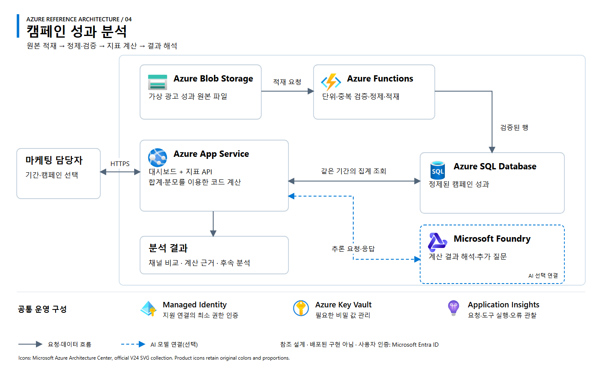

# 04. 캠페인 성과 분석

[워크숍 개요](../../README.md) · [아키텍처 원본 SVG](architecture.svg)

## 업무 범위

가상 광고 데이터를 적재·집계하고 같은 기간의 채널별 성과와 계산 근거를 제공하는 대시보드 또는 분석 에이전트입니다.

**처리 흐름:** 원본 파일 적재 → 단위·중복 검증 → 지표 계산 → 채널 비교·결과 해석.

## Azure 참조 아키텍처

**설계 상태:** 교육용 참조안이며 배포된 구현이 아닙니다. 실선은 요청·데이터 흐름, 파란 점선은 선택형 AI 연결입니다. 공통 운영 구성은 별도 설정이 필요합니다.

| 구성 | 역할 | 적용 기준 |
|---|---|---|
| Azure Blob Storage | 가상 광고 파일 원본 보관 | 파일 기반 적재·원본 재확인 |
| Azure Functions | 데이터 형식·단위·중복 검증 후 적재 | 소규모 이벤트·배치 처리 |
| Azure SQL Database | 정제된 성과 데이터와 기간별 집계 | 관계형 지표 조회 |
| Azure App Service | 대시보드·지표 계산 API | 사용자 요청과 시각화 |
| Microsoft Foundry Models | 계산 결과의 해석·후속 질문 | 자연어 분석이 필요한 경우 추가 |

CTR·CPC·CPA·ROAS는 합계와 분모를 기반으로 SQL·코드에서 계산합니다. 모델은 수치를 임의 생성하거나 검산을 대신하지 않습니다. 실제 광고 집행·예산 변경은 제외합니다.

## 입력·결과·완료 조건

| 구분 | 내용 |
|---|---|
| 입력 | 캠페인 ID·기간·비교 채널 |
| 데이터 | 합성 비용·노출·클릭·전환·귀속 매출 |
| 결과 | 채널 지표, 집계 범위, 계산 근거, 후속 분석 질문 |
| 정상 입력 | 동일 기간의 합계 기반 지표 계산 |
| 조건 변경 | 기간 변경 시 일별 비율 평균이 아닌 합계로 재계산 |
| 정보 누락 | 누락 데이터·0 분모를 구분하고 계산 불가 사유 표시 |

**구현 선택:** 소규모 파일과 로컬 계산으로 먼저 확인하고 반복 적재·공동 사용이 필요할 때 Azure 구성을 적용합니다.

## 참고

[인크로스 공식 사업 사례](https://www.sknetworks.co.kr/business/incross)에서 착안한 교육용 시나리오입니다. 실제 광고 계정이나 성과는 사용하지 않습니다. 아이콘은 [Microsoft 공식 Azure V24](https://learn.microsoft.com/en-us/azure/architecture/icons/)를 사용하며, 상세 출처와 사용 조건은 [공식 자료](../../docs/sources.md)를 참조합니다.
