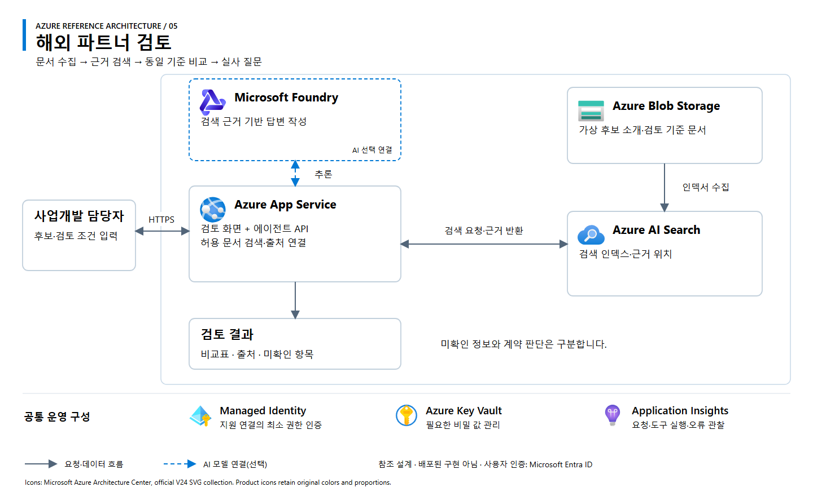

# 05. 해외 파트너 검토

[Workshop 개요](../../README.md) · [아키텍처 원본 SVG](architecture.svg)

## 업무 범위

가상 후보의 소개 자료와 검토 기준을 대조하고 근거가 있는 비교표, 미확인 항목, 추가 실사 질문을 제공하는 웹앱 또는 검토 에이전트입니다.

**처리 흐름:** 후보·기준 문서 수집 → 허용 문서 검색 → 동일 기준 비교 → 근거·누락 정보·질문 반환.

## Azure 참조 아키텍처

**설계 상태:** 교육용 참조안이며 배포된 구현이 아닙니다. 실선은 요청·데이터 흐름, 파란 점선은 선택형 AI 연결입니다. 공통 운영 구성은 별도 설정이 필요합니다.

| 구성 | 역할 | 적용 기준 |
|---|---|---|
| Azure Blob Storage | 가상 후보 소개·검토 기준 문서 | 원본 문서 보관 |
| Azure AI Search | 인덱서 수집·검색·근거 위치 반환 | 문서 수가 늘어나 검색이 필요한 경우 |
| Azure App Service | 검토 화면·검색 도구·에이전트 API | 요청 처리와 허용 문서 접근 |
| Microsoft Foundry Models | 검색 근거에 따른 비교·질문 생성 | 자연어 검토 기능이 필요한 경우 |

그림은 일반 검색 인덱스 기반 참조안이며 벡터 임베딩 모델을 필수로 가정하지 않습니다. 작은 정형 목록은 SQL·파일로 대체할 수 있습니다. 검색 결과에는 문서 위치·기준 시점을 포함하고 미확인 정보를 0점으로 처리하지 않습니다.

## 입력·결과·완료 조건

| 구분 | 내용 |
|---|---|
| 입력 | 대상 국가·후보·필수 역량·검토 기준 |
| 데이터 | 합성 후보 소개·역량 근거·평가 기준 |
| 결과 | 동일 기준 비교표, 인용 근거, 미확인 항목, 실사 질문 |
| 정상 입력 | 확인된 근거에 따라 비교 결과 작성 |
| 조건 변경 | 우선순위 변경에 따른 비교 근거 갱신 |
| 정보 누락 | 근거 부재를 낮은 점수로 단정하지 않고 확인 항목으로 분리 |

**구현 선택:** 검색·비교 도구로 시작하고 모델을 연결해 대화형 검토로 확장합니다. 실제 기업 평가·연락·발주·계약 실행은 제외합니다.

## 참고

[SK인텔릭스 해외 사업 사례](https://www.sknetworks.co.kr/pr/news-room/Y6uVZuF7IEBsVm2D)에서 착안한 교육용 시나리오입니다. 실제 파트너·계약 자료는 사용하지 않습니다. 아이콘은 [Microsoft 공식 Azure V24](https://learn.microsoft.com/en-us/azure/architecture/icons/)를 사용하며, 상세 출처와 사용 조건은 [공식 자료](../../docs/sources.md)를 참조합니다.
